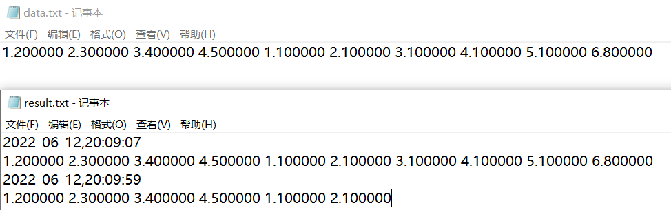

# A2：编程练习

实验指导书

 - P71-73 6, 7, 10
 - P75-76 17, 18
 - P95-96 10, 11, 12
 - P121 7, 8
 - P180 10

## 要求

与实验指导书不同的要求将使用<span style="color: #0095d9">蓝色</span>标出。

<span style="color: #0095d9">程序输出的文本可以使用中文或英文</span>。

9月27日晚实验课，由助教线下检查。

DDL: 未定。

## 1. 成绩转换

百分制与五分制的对照关系如下表所示

|   百分制    | 五分制 | GPA |
|:--------:|:---:|:---:|
| 100 ~ 95 | A+  | 4.3 |
| 94 ~ 90  |  A  | 4.0 |
| 86 ~ 85  | A-  | 3.7 |
| 84 ~ 82  | B+  | 3.3 |
| 81 ~ 78  |  B  | 3.0 |
| 77 ~ 75  | B-  | 2.7 |
| 74 ~ 72  | C+  | 2.3 |
| 71 ~ 68  |  C  | 2.0 |
| 67 ~ 65  | C-  | 1.7 |
|    64    | D+  | 1.5 |
| 63 ~ 61  |  D  | 1.3 |
|    60    | D-  | 1.0 |
|   < 60   |  F  |  0  |

要求：
- 百分制成绩用 `int` 类型时用 `switch` 语句实现程序的主结构，百分制成绩用 `float` 类型时用 `if` 语句实现程序的主结构。
- 在输入百分制成绩之前给出提示信息。
- 在输入百分制成绩后，需要判断输入成绩的合理性，对 0 ~ 100 之外的数据给出错误提示，并退出程序。
- 在输入结果中应包括百分制成绩及五分制等级的 GPA ，并要有文字说明。

程序运行示例：

```
输入一个整数的百分制成绩：96
百分制成绩 96 对应五分制 A+，GPA=4.3
输入一个实数的百分制成绩：96.5
百分制成绩 96.500000 对应五分制 A+，GPA=4.3
```

## 2. 判断指定年份是否为闰年

普通年份中能被 4 整除且不能被 100 整除的称为闰年，世纪年份中能被 400 整除的时闰年。编写程序，输入一个年份（如 2021），然后通过程序的判断，如果是闰年就输出这个年份为闰年，否则打印此年份不是闰年。

程序运行示例：

```
输入：20220
输出：2020年是闰年
```

## 3. 由四个数字组成三位数的情况

设计程序将由 5, 6, 7, 8 四个数字组成的所有三位数打印出来，要求这些三位数互不重复且每个不同数位的数字也不能重复。

程序运行示例：

```
567
568
576
...
```

## 4. 用牛顿迭代法求一个正数的平方根

设计程序用牛顿迭代法 $x_{n + 1} = x_n - f(x_n) / f'(x_n)$ 求一个正数的平方根。

输入一个整数，计算此正数的平方根，要求精度小于 $10^{-6}$ 。

<span style="color: #0095d9">注：此处要求的精度是指 $\mathrm{abs}(x_{k + 1} - x_{k}) < 10^{-6}$ 时， $x_{k + 1}$ 及后续结果均满足精度要求。</span>

## 5. 求解方程的根

求解方程 $3x^3 - 3x^2 + x - 6 = 0$ 的根。

 - 用牛顿迭代法求解方程在 $1.5$ 附近的根，精度小于 $10^{-6}$ 。<span style="color: #0095d9">此处精度要求同上。</span>
 - 用二分法求解方程在 $[-3, 3]$ 内的根，精度小于 $10^{-6}$ 。<span style="color: #0095d9">此处精度要求为 $\mathrm{abs}(f(mid) - 0) < 10^{-6}$ 。</span>
 - 统计两种方法的迭代次数（主要循环的执行次数）。
 - 比较并分析两种求解方法的结果与特点。

程序运行示例：

```
输入：输入牛顿迭代法的近似解：1.5
输出：x=1.585429，迭代次数为 4
输入：输入二分法解的范围：-3 3
输出：x=1.585429，迭代次数为 23
```

## 6. 判断标识符是否合法

 - 标识符最长按 32 个字符处理。
 - 从键盘输入一串字符，建议用字符串输入的方式，即用 `gets()` 函数或者 `scanf("%s")` ，如输入的字符串以 `000000` 开头，则结束程序的执行，否则进入下一步。
 - 根据 C 语言标识符的命名规则判断输入的字符串是否是合法的标识符（可不考虑关键字的处理），若是，打印是合法的标识符，否则打印不是合法的标识符，转到上一步继续。
 - 综合运用循环、`break` `continue` 等。

程序运行示例：

```
输入一串字符：123
"123" 不是合法的 C 标识符
输入一串字符：abc
"abc" 是合法的 C 标识符
输入一串字符：a
"a" 是合法的 C 标识符
输入一串字符：_da_fd
"_da_fd" 是合法的 C 标识符
输入一串字符：abc23daf3
"abc23daf3" 是合法的 C 标识符
输入一串字符：000000
```


## 7. 背包问题的贪心求解

有一个背包最大可以容纳 $x$ 重量的物品，现在有 $n$ 个物品，均有各自的重量和价值。问如何将这些物品装入这个背包里，使得背包里物品的价值最大，且其重量不能超过背包的最大容量。

 - 0-1 背包问题：每种物品仅 1 个，不可拆分，只能全部装入或不装入。
 - 部分背包问题：每种物品仅 1 个，可以拆分，可以全部装入或按重量（按比例）拆分后装入。

要求：
 - 用贪心法分别按照价值和单位重量价值（物品的价值除以物品的重量）求解 0-1 背包问题 ，<span style="color: #b94047">不需要得到最优解</span>。
 - 用贪心法按单位重量价值求解部分背包问题。
 - 输出 $n(3 \le n \le 10)$ 个物品的编号、重量和价值，以及背包可以容纳的重量 $x$ ，可以不按顺序输入，但程序里必须根据需要进行排序。
 - 打印输出背包里装入物品的总价值、装了哪些物品及其重量和价值。

提示：
 - 可以用多个数组表示物品的属性（编号、重量、价值和单位重量价值等）。
 - 数组排序方法可以任选使用。

程序运行示例：

```
输入背包的容量：5
输入物品的个数：3
输入 3 个物品的编号：1 2 3
输入 3 个物品的重量：1 2 3
输入 3 个物品的价值：60 100 120
0-1 背包问题的按价值贪心求解：
3 号物品 重量：3.000000 价值：120.000000 装入背包
2 号物品 重量：2.000000 价值：100.000000 装入背包
装入背包的物品总价值为：220.000000
0-1 背包的按单位价值贪心法求解：
1 号物品 重量：1.000000 价值：60.000000 装入背包
2 号物品 重量：2.000000 价值：100.000000 装入背包
3 号物品 重量：3.000000 价值：120.000000 单位价值：40.000000，其中 2.000000 重价值 80.000000 装入背包
装入背包的物品总价值为：240.000000
```

## 8. 浮点数组与文件读写操作

 - 浮点数存储在当前文件夹里的 `data.txt` 文本文件中，运行结果写入当前文件夹里的 `result.txt` 文本文件中。
 - 第一次运行程序，或 `data.txt` 文件不存在时，需要通过程序输入浮点数数据的个数，以及每一个数据，并把浮点数据写入 `data.txt` 文件中。
 - 获得系统当前的日期（年、月、日）和时间（时、分、秒），从 `data.txt` 文件中读取指定个数的浮点数到数组中，<span style="color: #0095d9">不要求排序</span>。
 - 将日期和时间单独一行写入 `result.txt` 文件中，紧接着把排序后的数组写在日期和时间的下一行。

程序运行示例：运行两次后的结果如下图

```
有几个数（1~100）：10
输入 10 个数：1.2 2.3 3.4 4.5 1.1 2.1 3.1 4.1 5.1 6.8

有几个数（1~100）：6
```



## 9. 天数计算

编写函数计算给定日期是本年度第几天。

 - 日期为分别用整数表示的年、月、日。
 - 函数形参为三个整型参数，分别表示年、月、日。

拓展：如果日期是带格式的字符串，如 `2022-10-01` 或 `2022/10/01` ，请尝试编写函数实现本题的功能。

## 10. 求复数积

编写函数求解两个复数之积。

复数的结构体定义如下

```cpp
struct complex
{
    int real;
    int imag;
}
```

函数原型参考：

```cpp
struct complex complexMul(struct complex c1, struct complex c2);
```

拓展：编写复数计算器，完成复数的其他运算功能。

## 11. 求一元函数定积分的通用函数

实验要点：指向函数的指针。

 - 利用指向函数的指针，实现矩形法求一元函数定积分的通用函数，并在主函数中验证正弦函数、余弦函数、指数函数的定积分。
 - 可以直接调用数学函数库中定义的正弦函数、余弦函数、指数函数。
